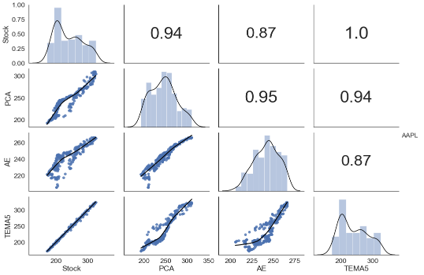
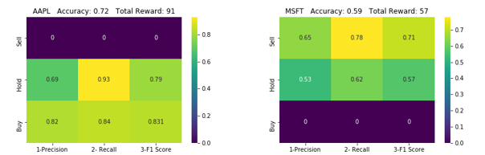

# EFFECTIVE ALGORITHMS FOR STOCK TRADING

## 1. DJIA Stock Data 

The dataset includes three years of stock data from Jan 2018 to Dec 2020. Two and a half years are allocated for training, while the last six months are for testing. Dow Jones stocks are preferred, representing the top 30 US companies. However, two stocks were removed due to insufficient three-year data, resulting in 28 stocks.

## 2. Approach & Objective

Objective: 

1. **Volatility Forecast:** Develop and evaluate an LSTM model for forecasting volatility in financial markets using historical return data and realized volatility, assessed through data exploration and visualization.

2. **Best Stock Price Method:** Construct and evaluate a stock prediction method incorporating ARIMA modeling, autoencoder neural networks, and PCA-based reconstruction.

3. **Decision Tree:** Optimize trading patterns by identifying the ideal look-back period maximizing returns in stock trading through decision tree analysis.

4. **Backtesting:** Develop a trading strategy using MACD signals and evaluate its performance through reinforcement learning to assess the suitability of each DJIA stock after a 6-month trading period.

## 3. Research Summary

The study began with deep learning techniques, particularly LSTM, for daily return volatility forecasting. After optimization, LSTM 2 surpassed traditional models like GARCH and RNN, showcasing superior predictive capabilities.

Next, technical indicators were evaluated, with TEMA5 emerging as the most accurate stock price predictor, outperforming advanced models like Fourier transform, ARIMA, PCA, and AE.

Decision tree analysis confirmed the efficacy of five-day and twenty-day returns in predicting stock movements across a portfolio of 28 DJIA stocks.

The study concluded with a Deep Learning RL model for automated trading, integrating MACD and TEMA5 indicators. The RL model exhibited human-like trading behavior, automating trading strategies and achieving profit for 1/3 of DJIA stocks within the specified period.

## 4.1 Volatility Forecast

RNN, or recurrent neural network, utilizes information earlier in the sequence to make predictions by updating weights. However, with many time steps, it can suffer from gradient vanishing. 

An improvement over RNN is LSTM (Long Short Term Memory), which introduces controls by introducing the gates to prevent gradient vanishing. Then can further optimize the LSTM model by adding additional training days and stacking more layers, creating what known as the LSTM 2 model, distinct from the first one. 

Finally, used the GARCH mathematical model, which has received the Nobel award, to determine volatility. The process is use to describes the irregular pattern of variation of residual error in a statistical model. 

Let's see which model gives the most accurate forecast for volatility.

This code is an experiment in forecasting volatility using LSTM models. Here's an overview of the steps and concepts involved:

### Model Development

1. **Libraries Import**: Import necessary libraries such as Keras, pandas, and matplotlib/seaborn.

2. **Data Preparation**: Read in a CSV file containing financial data for various assets and create a dataset.

3. **Normalization**: Normalize the dataset using a scaling factor calculated based on the second raw moment of the data.

4. **Sequence Generation**: Convert the dataset into a supervised learning problem by creating sequences of data points with a specified look-back window.

5. **Model Definition**: Construct a sequential LSTM model with dropout regularization.

6. **Model Compilation**: Compile the model using a custom loss function.

7. **Training and Evaluation**: Train and evaluate the model using an online learning approach.

8. **Inversion of Scaling**: Invert the predicted volatility values back to their original scale.

9. **Average Volatility Calculation**: Calculate the average predicted volatility for each asset over a specified period.

10. **Visualization**: Plot the average volatility for each asset on a bar chart.

### Results

The boxplot of the MSE measure distributions related to all of the 28 Dow Jon Stocks from the 4 models shows noticeable noise for LSTM and GARCH model.

The 4 models are plotted on a cumulative chart to visualize the error. LSTM 2 model outperforms GARCH despite the latter's widespread use in solving parametric problems. LSTM 2 also performs slightly better than RNN.

LSTM 2 has been chosen as the best forecast and is used to generate the chart for 28 Dow Jones Stocks. BA and AXP are the highest volatile stocks, whereas WMT and VZ stocks have the lowest volatility.

### 4.2 Stock Prediction Method

Technical Indicators which based on Moving Average methods, Time Series which consists of Fourier Transform and ARIMA. Machine & Deep Learning Application such as Principal Components Analysis. In short we called it as PCA. PCA work on the concept of find the best fit line to reduce the dimension.  The last one is Deep Learning which Autoencoder that can be used to encode price movements and decode to reconstruct time series data.     

Some Definitions: 

- **Moving Average (MA)** smooths out price fluctuations by averaging them, while **Exponential Moving Average (EMA)** gives more importance to recent prices; **Triple Exponential Moving Average (TEMA)** is the most sensitive, followed by **Double EMA (DEMA)**, theoretically providing the closest price indication; Weighted Moving Average assigns varying importance to recent data points, while **Triangular Moving Average** calculates the average price over a set number of data points.

- **Fourier Transform (FT)** decomposes time series into short and long-term trends, aiding in eliminating random walks and estimating stock movement;

- **ARIMA (Autoregressive Integrated Moving Average)** model forecasts data based on lag order, differencing degree, and moving average order, with "auto_arima" function in "pmdarima" determining optimal parameters; 

- **Principal Components Analysis (PCA)** compresses and reconstructs price movement by reducing dimensions without loss of accuracy, an unsupervised technique in machine learning; 

- Deep Learning, a subset of machine learning, employs artificial neural networks to interpret data at multiple levels, with **Autoencoder (AE)** learning hidden layers to reduce reconstruction error and capture price movements.

### Model Development

1. **Setup**: Import libraries and load historical stock data.

2. **Modeling**: Create prediction models using Moving Average, Exponential Moving Average, and other techniques.Then utilize Autoregressive Integrated Moving Average (ARIMA) and Autoencoder (AE) models.

3. **Evaluation**: Assess models based on Root Mean Square Error (RMSE) to select the best-performing one for each stock.

4. **Visualization**: Visualize time series data, model predictions, and correlations between actual and predicted values.

5. **Selection**: Choose the best prediction method, such as Triple Exponential Moving Average (TEMA), based on evaluation metrics.

### Results

The following is the exmaple of AAPL Stock: 

This is the example of apple stock that has plotted based on last 3 years. The blues colour lines are exponential moving average methods which are within the bands for all the times, especially double and triple exponential moving average.  These have shown that exponential moving average are more sensitive when come to fluctuating of prices. In this comparison, TEMA5 is the best. 

Fourier Transform (FT) and ARIMA can fall within bands for most of the times. It is obvious the more components generated from FT, the price will be closer to actual price.  FT and ARIMA are still not as accuracy as to Triple EMA. 

Time series plotted below which shown that TEMA5 is better method as compared to AE and PCA

Even compare to Pearson correlation, TEMA5, it is about 1 as compare to PCA and AE. So it is confirm that the best prediction method for experiment 2. 

## 4.3 Trading Pattern (Decision Tree)

The figure highlighted on how the model learns a rule. During training, the tree scans the features and find out the threshold to split the data in order to minimise the loss that results from the predictions made using the subset that would result from the split, weighted by the number of samples in each subset with the form of recursive binary splitting. Recursive binary splitting is to learn from top to down through repetition process which known as greedy approach.  

In this case, it is used to determine the best fast period and slow period for Moving Average Convergence Divergence (MACD). MACD will be use as trading signal. 

Another 2 more features are added, known as t- 5 and t-20. 5 and 20 are basically the look back days. For label class, if there is a postive in the return, the label class will be 1, otherwise it will be 0.

### Model Development

Sure, here's a concise summary of the steps for the code:

1. **Get Data**: Read in a CSV file containing financial data and prepare the dataset for analysis.

2. **Explore Data**: Analyze and describe the dataset.

3. **Simple Regression Tree**: Train a decision tree regression model using two lag variables and visualize the tree structure.

4. **Compare with Linear Regression**: Compare the decision tree regression with ordinary least squares (OLS) linear regression.

5. **Compare with Linear Time Series Models**: Compare the decision tree regression with autoregressive (AR) and autoregressive moving average (ARMA) time series models.

6. **Decision Surfaces**: Plot decision surfaces for both time series models to illustrate their predictive capabilities.

7. **Simple Classification Tree**: Train a decision tree classification model to predict binary outcomes based on lag variables.

8. **Loss Functions**: Explore and compare different classification loss functions.

9. **Compare with Logistic Regression**: Compare the decision tree classification with logistic regression.

10. **Regression Tree with All Features**: Train a decision tree regression model using all available features and evaluate its performance.

11. **Classification Tree with All Features**: Train a decision tree classification model using all available features and evaluate its performance.

12. **Print Decision Path**: Print the decision path for the trained classification tree.

### Results

Final Tree

To evaluate the predictive accuracy of the classification tree, test dataset is used to generate the predicted class probabilities based on AUC-ROC which is a performance measured used in classification problem.
 

The result indicates a high accuracy of 0.77 which is well beyond the 0.5 baseline for 28 DJIA stocks. This has shown that look-back return of 5-day and 20-day are generally acceptable to use fast period and slow period respectively for Moving Average Convergence Divergence (MACD) in back-testing. 

## 4.4 Back-Testing Model (Reinforcement Learning (RL))

This back-testing model utilizes deep reinforcement learning (RL) to simulate market behavior and optimize trading algorithms. RL aims to maximize long-term rewards by selecting action sequences. Compared to decision trees, RL is better suited for learning trading rules and can be enhanced further by integrating with deep learning (DL) to capture complex data features.

### Overall Setup of RL

• **Environment**: The environment comprises historical stock prices, returns, and technical indicators.

• **State**: Defined by hyperparameters including look-back days, action combinations, and the number of features. Look-back refers to the number of days considered before, along with the number of technical indicators in the dataset.

• **Action/Reward**: Market actions include buy, hold, and sell. Correct predictions for buy or sell actions result in a reward increase of (+)1, while incorrect predictions result in a decrease of (-)1. Holding position, regardless of correctness, maintains the reward at its current level.
   - (+)1 indicates a long position, anticipating stock rise.
   - (-)1 indicates a short position, anticipating stock drop.
   - 0 indicates a hold position, with no change in share ownership.

• **Agent**: Utilizes Q-learning to develop policies for buy, hold, or sell actions based on past experiences, aiming to maximize the total reward's expected value.

### Moving Average Convergence Divergence (MACD)

The 20-day and 5-day Moving Average Convergence Divergence (MACD) is a widely employed trading signal, especially for short-term trading. With a confirmed accuracy of 0.77 from the Decision Tree experiment, it acts as a reliable momentum indicator for generating entry and exit signals.

   - Sell Entry: >0.2
   - Sell Exit: < 0.05 
   - Buy Entry: >-0.2
   - Buy Exit: >-0.05

Example of AAPL Stock in MACD:

### Model Development

1. **Import Libraries**: Import necessary libraries including pandas, numpy, matplotlib, and others.
2. **Load Data**: Load historical stock price data from Yahoo Finance using pandas_datareader.
3. **Prepare Dataset**: Prepare the dataset by calculating the MACD (Moving Average Convergence Divergence) and scaling features.
4. **Implement MACD Trading Strategy**: Implement the MACD trading strategy using the calculated MACD values.
5. **Create and Train the Agent**: Create an agent using the Agent class and train it using the prepared dataset.
6. **Run the Agent**: Run the agent to train it and save the checkpoints.
7. **Evaluate the Model**: Evaluate the trained agent by making predictions on the test data and calculating accuracy, precision, recall, and F1-score.
8. **Plot Strategy**: Plot the true and predicted trading positions to visualize the performance of the model.

### Results

The replication of the trading strategy is evaluated by comparing the actions predicted by the agent with the actions determined by the strategy. This comparison is quantified using accuracy and presented in a confusion matrix. Here are the key terms in the confusion matrix:

- **Precision**: The frequency of correct matches.
- **Recall**: The sensitivity of the correct matches.
- **F1 Score**: The average of Precision and Recall.

AAPL shows high accuracy in terms of precision, recall, and F1 score for hold and buy actions, but it scores zero for sell actions. Conversely, MSFT exhibits accuracy for hold and sell actions but zero for buy actions. Consequently, the back-testing model is not suitable for use with AAPL and MSFT.

KO demonstrates high accuracy in precision for sell actions but low accuracy in recall. However, it scores zero for all buy actions. Conversely, JNJ exhibits very high accuracy in precision, recall, and F1 score for sell actions, but it scores zero for hold and buy actions. Consequently, the back-testing model is not suitable for use with KO and JNJ.

WMT demonstrates an accuracy of 0.5 for both buy and sell actions, with even lower accuracy for hold actions. Conversely, CVX exhibits very high accuracy in terms of precision, recall, and F1 score for all three actions. Consequently, the back-testing model is not suitable for use with WMT but is suitable for CVX.

VZ exhibits high accuracy for both buy and sell actions, although it falls below 0.5 for hold. Therefore, the back-testing model is considered suitable for VZ. Conversely, XOM demonstrates very high accuracy in buy actions, but the accuracy for sell and hold is much lower than 0.5. Thus, the back-testing model is not suitable for XOM.

The table summarizes the performance of 28 DJIA stocks based on back-testing. It's noted that volatility doesn't correlate with any features, while reward and accuracy are highly correlated. Only 11 out of the 28 stocks are suitable for the back-testing model, suggesting profitability despite market fluctuations during the COVID-19 period. Additionally, the model's stock suitability assessment indirectly aids in selecting the best stocks for trading based on reward and accuracy. This selection scope could extend to stocks from S&P 500 or Russell 3000.

The average accuracy for the back-testing model across the 28 DJIA stocks is 0.67, surpassing the target of 0.60. Overall, the model effectively achieves the report's objective of providing efficient algorithms for stock trading.

## Future Works 

The back-testing model demonstrates effective trading algorithms for DJIA stocks, but it should be more complex, as per Investopedia. Adding volatility as a feature to check daily returns is crucial, especially for portfolio management leverage. Traders aim to minimize volatility to reduce risk and facilitate smoother transitions in and out of stocks.

The RL model establishment overlooks portfolio profiles, including cash, transaction fees, and interest rates. Exploring efficient portfolio frontiers could be beneficial in future work. Diversification across sectors is essential to mitigate uncertainty by spreading risk across different sectors.

Volume trading is vital and could be linked to market sentiment, often measured using Twitter data through text mining techniques. However, back-testing may lead to over-optimization, where past performance doesn't accurately predict future results. Hence, it's crucial not to overly optimize rules to maintain their comprehensibility.

Ultimately, back-testing alone may not reliably gauge trading effectiveness, as past success doesn't guarantee future performance.

## Reference

1.	https://colah.github.io/posts/2015-08-Understanding-LSTMs/
2.	https://github.com/borisbanushev/stockpredictionai#technicalind
3.	https://en.wikipedia.org/wiki/Stock_market_prediction
4.	https://en.wikipedia.org/wiki/Efficient-market_hypothesis
5.	https://www.investopedia.com/
6.	Hands-On Deep Learning for Finance, implement deep learning techniques and algorithms to create powerful trading strategies – Luigi Troiano, Arjun Bhandari, Elena Mejuto Villa (2020)
7.	Hands-On Machine Learning for Algorithmic Trading - Stefan Jansen (2018)
